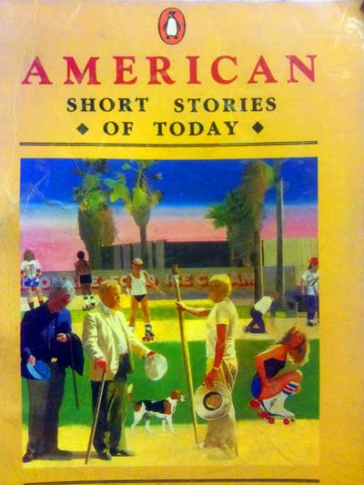

美国短篇小说选
========

--------------------------------------------------------------
## 唯者

> 在美国，也许*Fredric Brown*是因为他那神秘的科幻故事而广为人知的。
> 但是他也写一些古怪有趣并且有启发性的故事，就象下面的这篇。
> 这个简单的寓言的第二句话成了’唯者(solipsist)’一个绝好的注解。

* 中文 [《唯者》](e_03_唯者.md)
* 英文 [《The Solipsist》](e_03_the_solipsist.md)