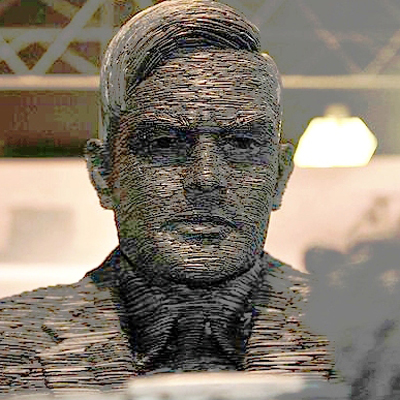

---
tags:
- Novel
- Science Fiction
---

# 背叛图灵的人
> By [Christopher K. Miller][link0]

> "人们在哪儿？" 穿呢子大衣的人转过脸来。“跑了，“他说，声音低如耳语。“都跑了”

-----------------------------------------------

**"这不是我的手，"** 阿诺德(*Arnold*)说。

他记得声音，千人的声音，还有醋的味道，陌生的气味，医院的气味，
接着声音一起涌来，化作一个声音，他的声音，不是说话而是思考，
接着他睁开眼，发现自己笔直摆在软椅中，看身形彷佛也是活的。
赤足下一片冰冷的金属地板。俯视下去他看到了这些手。
他试图触碰那些陌生的手，那些向前伸着的手。
他把手放到膝上，这些陌生的手也摸了过来。
“这些手是 ... 蓝的。 保罗.克莱尔 (*Pale.Clear*)“

”请保持安静，“一个声音说道，男人的声音。

阿诺德在椅中抽搐，惊恐万分。他打量四周。
除了自己近旁一点可怜的光亮，四周笼罩着毫无特色的黑暗。
"谁在那儿？出来！"

但是为什么？他寻思着，我被吓到了？之前什么人和我说过什么？

“请保持安静。如果你紧张，试验会产生误差。”

“出来！”他再次喊道。

# 附录

 [英文原文猛击这里][link1]

[link0]: http://www.cosmosmagazine.com/author/craig-delancey/
[link1]: http://www.cosmosmagazine.com/science-fiction/the-man-who-betrayed-turing/