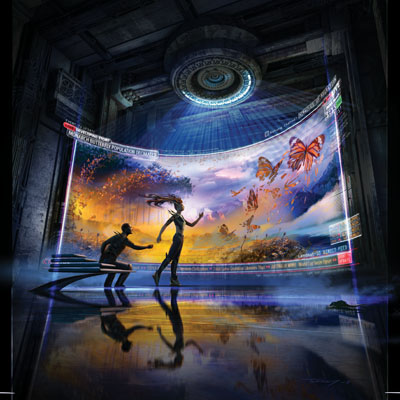

> By [Christopher K. Miller][link0]

> 在完全认知和认知情绪状态管理上，我们还有很长的路要走。
> 我认为这是艺术的最终形式。

-----------------------------------------------

墨西哥城西一百二十公里，马德雷山脉(Sierra Madre)崎岖的森林之中，
生态旅游者成群结队在 *iStuds* 和其他的 *ejewelry* 上记录着事件。

一个 IMAX 剧组在帝蝴蝶生态保护区为他们的电影 *迁徙的奇迹* 拍摄着珍贵的镜头。 
感谢清澈的天空以及一个 USGS 的地球资源卫星几乎10次直接从头顶经过，
Google Earth 在反常的第一个小时里赚了8千万美元，其中大部分是为了生存的重定向。

.... 靠，不是这文章狗屎，就是我是狗屎，完全看不懂，以后再译吧 ... -_-! 

# 附录

 [英文原文猛击这里][link0]

[link0]: http://www.cosmosmagazine.com/science-fiction/interweave/
[link1]: http://www.cosmosmagazine.com/news/top-12-sci-fi-stories-2012/