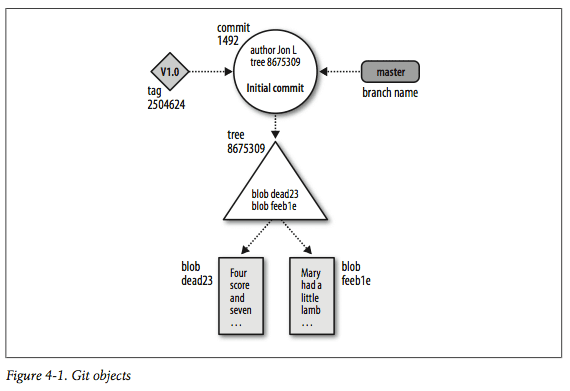
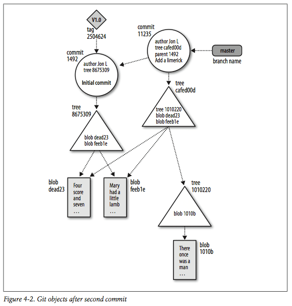

## 基础概念

前一章展示了一个典型的 Git 应用，读到这里，你可能会问：
Git 每个提交都会保存实体文件吗？
`.git`目录是干虾米的？为什么提交的ID都是一组诡异的字符串？
我该不该关心它涅？

如果你之前用过其他的版本控制系统（**VCS**），比如 `Subversion` 或 `CVS`，
后面章节中的命令你会看着有点眼熟。
是的， Git 有同样的功能并且如你所愿，提供所有现代版本控制系统该有的操作。
然而，在一些很基本的地方，Git却与其他的版本控制系统有着触及灵魂的不同。

本章，我们将通过检验Git体系中的一些关键组件和一些重要的概念，
来了解 Git 为什么不同？哪里不同？
这里我们关注基础的东东，并展示如何与一个库互动。
第十一章会阐明如何与一些互相关联的库一起工作。
同时持续追踪多个库看起来有点让人望而生畏，
但是同你从本章学到的原理是一样的。

### 仓库

一个 Git 仓库就是一个简单的数据库，包含了一个项目所有的版本信息和历史记录。
和大多数版本控制系统一样，一个仓库保有了整个项目生命周期内完整的拷贝。
然而，不同的是，Git 仓库不只提供了库里所有文件的完整工作拷贝，
而且还提供了仓库本身的工作副本。

Git 在每个仓库中都维护了一个配置项集合。
在前面的章节，你已经看到过它们了，比如仓库的用户名和邮件地址等。
与文件数据和其他库的元数据不同，库的配置设定在克隆或复制过程中会被忽略。
相反的，Git 为每个地址，每个用户，每个库管理和检查配置，设置信息。

在一个库内，Git 维护了两个主要的数据结构，**对象存储**和**索引**。
库内的所有数据都存放在你工作根目录一个隐藏的名为 `.git` 的子目录内。

作为一个支持彻底的分布式**VCS**机制的一部分，
**对象存储**被设计成在克隆操作期间拷贝非常高效。
索引是一个库私有的临时信息，并且可以按需创建和修改。

接下来的两节我们将描述对象存储和索引更多的细节。

### Git 对象类型

对象存储是 Git 仓库实现的心脏。它包括你原始的数据文件和所有的日志信息，作者信息，
日期，以及其他建造项目他版本或者分支所必要的信息。

在对象存储中，Git 只设置了四种对象类型：blobs, trees, commits, 和 tags.
这四种原子对象构建了 Git 高级数据结构的基础。

*Blobs*
> 一个文件的每个版本都被作为一个 blob。 
> "Blob" 是 "binary large object"的缩写，一个常用术语，
> 指一些变量或者文件，可以包含任何数据，并且程序并不关心其内部的结构。
> blob 被视为黑箱。它持有一个文件的数据，但是并不包含任何文件元数据，甚至文件名。

*Trees*
> 一个树对象表示一级目录的信息。
> 它记录了 blob 标识，路径名，以及一个目录内所有文件的元数据。
> 它也能递归的引用其它子树对象，并由此构建一个完整的文件和子目录的层级关系。

*Commits*
> 一个提交对象持有每次引入仓库的修改的元数据，包括作者，提交者，提交日期，以及日志信息。
> 每个提交指向一个树对象，表示对整个库提交执行后的一个完整快照。
> 初始提交，或者说，根提交，没有父。大多数提交都有一个父提交，
> 通过第九节，我会解释为什么一个提交可以指向多个父

*Tags*
> 一个标签对象就是给一个特殊对象指派一个人比较好读的名字，通常是一个提交。
> 虽然 9da581d910c9c4ac93557ca4859e767f5caf5169 指向一个确切的，并且完好定义的提交，
> 但是一个更熟悉的，类似 Ver-1.0-Alpha 的标签名可能更有意义一些。

随着时间推移，对象存储的所有信息都在改变和增长，跟踪你的项目的修改，增加，和删除。
为了更有效率的使用磁盘空间和网络带宽，Git 把这些对象压缩在打包，也存放在对象存储内。

### 索引

索引是一个临时的动态二进制文件，描述了整个仓库的目录结构。
确切的的说，索引保存了整个项目某一时刻的所有结构的一个版本。
项目的状态可以被历史记录里的任何一个提交或者tree表现出来。
或者对于你正在做的开发，它也可以是一个未来的状态。

Git 特有的特性之一就是允许你用系统的，明晰的步骤修改索引的内容。
索引允许增量的开发步骤与这些改变的提交分开。
(译者：不知道怎么翻译好了，原文是：The index allows a separation 
between incremental development steps 
and the committal of those changes.)

下面我们讲讲它是怎么工作的。作为开发者，你执行 Git 命令来改动索引。
改动，通常是增加，删除，或编辑一些文件或者文件集合。
索引记录且保留这些改动，直到你准备提交它们。
你也能从索引中删除或者替换这些改动。
因此，索引允许你把一个复杂的仓库状态平缓的过渡到一个更好的状态去。

就像我们第九章将了解到的，索引在合并过程中扮演了重要的角色，
它可以允许你同时管理，检视，操作同一个文件的多个版本。

### 根据内容寻址的名称

Git 的对象存储被组织和实现成一个据内容寻址的存储系统。
确切的说，对象存储的每个对象都有一个唯一的名称，
即根据其内容做 SHA1 产生的一个 SHA1 哈希值。
由于对象所有的内容都参与了哈希运算，并且这个哈希值被认为对于特定的内容是具备有效的唯一性的，
因此 SHA1 哈希足够作为索引或者对象数据库中对象的名称。
一个文件任何微小的变化都会导致 SHA1 哈希值的改变，从而导致文件新的版本被分别的索引。

SHA1 值是一个 160-bit 值，通常显示成一个 40 位的十六进制数，
比如 `9da581d910c9c4ac93557ca4859e767f5caf5169`。
有时候，在显示的时候，SHA1 值被缩写成一个更简单，唯一的前缀。
Git 用户所说的 SHA1，哈希码，或者 object ID ，是一个意思。

> **全局唯一标识符**
> 
> SHA1 算法一个重要的特性就是无论什么样的内容，对于同样的内容总是算出同样的 ID。
> 换句话说，不同目录中，甚至不同机器上相同的文件内容总是得到完全一样的 SHA1 哈希 ID。
> 因此，一个文件的 SHA1 哈希 ID就是一个全局唯一的标示符。
> 一个理所应当的推论就是，仅仅通过比较它们的 SHA1 标示符，就能跨越互联网比较
> 任何尺寸的文件和 blob 是否相同。
> 

### Git 内容追踪

比把 Git 看做一个版本控制系统更重要的是，Git 是一个内容追踪系统。
这个微妙的区别指导着 Git 的设计，并且也许是Git可以相对灵活的管理内部数据的关键原因。
同时，这也可能是Git新手最难理解的一个概念之一，因此很是值得详细的讲讲。

Git 内容追踪在两个重要的方面与其他绝大多数版本控制系统有着根本的不同。

首先，Git 的对象存储基于对象自身内容的哈希计算，而不是用户的原始文件或目录名。
因此，Git 是依靠数据内容的哈希而不是文件名把一个文件放置到对象存储中的。
事实上，Git 并不追踪文件或者目录的名称，这是关联文件的次要方法。
再次强调，Git 追踪内容而不是文件。

如果两个不同目录的各自一个文件，有着完全相同的内容，
Git 会在对象存储中用 blob 保留一份唯一的内容拷贝。
Git 为每个文件都计算一份唯一的哈希值，如果文件 SHA1 值相同，那么内容也相同，
然后通过 SHA1 值索引在对象存储中。
项目中所有的文件，无论存在用户的那个目录结构中，都使用同样的内容对象。

如果这些文件中的一个发生了改变，Git 会为它计算一个新的 SHA1，
在确定了它是一个新的 blob 对象之后，就会把这个新的 blob 加入到对象存储中。
原来的 blob 保留在对象对象存储中以便未改变的文件来使用它。

其次，Git 的内部数据库高效保存着每个文件的每个版本，
而不是文件一个修订到下一个之间的差异。
因为 Git 采用一个文件的哈希作为它的名字，所以每次完整拷贝文件的时候都会用到它。
它即不能把它的工作或者对象存储实体基于文件部分内容，也不能基于文件两个修订之间的差异。

从用户典型的视角来看，一个文件有很多修订，逐渐从一个修订到另一个修订到一个直接的成品。
Git 通过一组不同 blob 之间各种哈希的集合来计算文件的历史，而不是直接保存文件名
和一组差异。这好像有点怪，但是这个特点让 Git 非常灵活的执行某些任务。

### 路径名 vs 内容

就像许多其他的版本控制系统一样，Git 需要在仓库中维护一个清晰的文件列表。
然而，这并不需 Git 基于文件名来维护。
的确，Git 用一块特殊的数据（与文件内容不同）处理一个一个文件的名称。
通过这种方法，它就像传统的数据库一样把“索引”和“数据”隔离开来。
表 4-1 粗略的比较了 Git 和其他常见的系统，或许对你有所帮助。

*表 4-1. 数据库比较*

系统          | 索引机制                       | 数据存储
-------------|-------------------------------|----------------------
传统数据库     | ISAM                          | 数据记录
Unix 文件系统  |  目录(/path/to/file)           | 数据块
Git          | .git/objects/hash, tree对象内容 | Blob 对象, tree对象

## 对象存储全景图

看给我们看看Git的对象如何相互配合一起工作，从而形成一个完整的系统。
blob 对象位于数据结构的“底部”；它不引用任何东西，并且只被 tree 对象引用。
在接下来的图表中，每个 blob 都被表示为一个矩形。

tree 对象指向 blob，并且也可能同样指向其他的 tree。
一个给定的 tree 对象可以被多个不同的 commit 对象引用。
每个 tree 都被表示为一个三角形。

一个圆代表一个 commit。
commit 指向一个特定的被自己引入仓库的 tree。
分支不是基本Git对象，但是它在命名提交方面仍然扮演着一个重要的角色。
每个分支都被画作一个圆角矩形。

图 4-1 介绍这些对象如何配合在一起。
图中显示了一个仓库在一个单独初始提交后又增加了两个文件的状态。
所有的文件都位于顶级目录中。
master 分支和名为 *V1.0* 的 tag 都指向一个 ID 为 *8675309* 的 commit。

现在，咱来点复杂的。
让我们增加一个新的子目录，并在里面放一个文件。
对象存储的结果就像 图 4-2。

就像上一张图一样，
新的 commit 增加一个 tree 对象的关联以呈现目录和文件的整体状态。
这个例子中，tree 对象的ID是 *cafed00d*。

由于顶层目录多了一个新的子目录所以它发生了改变，
顶层的 tree 对象也同时发生了改变，所以 Git 引入了一个新的 tree，*cafed00d*。

然而，blob *dead23* 和 *feeb1e* 从第一次提交到第二次并没有变动
Git 意识到 ID 并未改变，因此可以被新的 *cafed00d* 树直接引用。

请注意 commit 间箭头的方向。父 commit 或者说早先的 commit。
因此，在 Git 的实现里，每个 comment 都指回它的父或者父们。
很多同学会感到有点困惑，因为一个库的状态按照常理来说应该恰恰相反：
作为一个数据流，应该是从父 commit 到子 commit。

在第六节，我们会扩展开来，
说说一个仓库的历史记录是如何被各种命令操纵和建立起来的。

## Git 概念实操

抛开一些原理，让我们看看这些概念和组件在一个仓库里是怎么一起配合的。
让我们创建一个新库，查看一下内部文件和对象存储的更多细节。

### .git 目录之内

作为开始，用 `git init` 初始化一个空库，然后运行 `find` 命令看看我们到底创建了啥：

	$ mkdir /tmp/hello
	$ cd /tmp/hello
	$ git init
	Initialized empty Git repository in /tmp/hello/.git/
	# List all the files in the current directory 
	$ find .
	.
	./.git
	./.git/hooks 
	./.git/hooks/commit-msg.sample 
	./.git/hooks/applypatch-msg.sample 
	./.git/hooks/pre-applypatch.sample 
	./.git/hooks/post-commit.sample 
	./.git/hooks/pre-rebase.sample 
	./.git/hooks/post-receive.sample 
	./.git/hooks/prepare-commit-msg.sample 
	./.git/hooks/post-update.sample 
	./.git/hooks/pre-commit.sample 
	./.git/hooks/update.sample
	./.git/refs
	./.git/refs/heads
	./.git/refs/tags
	./.git/config
	./.git/objects
	./.git/objects/pack ./.git/objects/info
	./.git/description
	./.git/HEAD
	./.git/branches
	./.git/info
	./.git/info/exclude

如你所见， *.git* 包括了很多东东。所有的文件都基于一个你可以调整模板目录。
根据你使用的 Git 版本的不通，你实践的文件清单可能会有些许不通。
比如，老版本的 Git 不会为 *.git/hooks* 里的文件加上 *.sample* 后缀。
通常来说，你不需要看到和维护 *.git* 内的文件。 
这些 "隐藏" 文件被认为是 Git 的管道或者配置的一部分。
（*译者: 不知道怎么翻译了原文是: These “hidden” files are considered part of Git’s plumbing, or configuration*）
Git 有一个管道命令的小集合来维护这些隐藏文件，但是你很少会有机会用到它们。
一开始， *.git/objects* 目录（存放 Git 所有对象的目录）是空的，
只有几个占位符：

	$ find .git/objects
	.git/objects 
	.git/objects/pack 
	.git/objects/info

让我们小心的创建一个简单对象:

	$ echo "hello world" > hello.txt 
	$ git add hello.txt

如果你键入 "hello world" （不要改变空格和大小写），
你的对象目录应该看起来像这样：

	$ find .git/objects
	.git/objects
	.git/objects/pack
	.git/objects/3b 
	.git/objects/3b/18e512dba79e4c8300dd08aeb37f8e728b8dad 
	.git/objects/info

所有这些都看起来很玄乎。但是非也，下一节我们会详细解释一下。

### 对象，哈希，以及 Blobs

当创建为 *hello.txt* 创建对象的时候，Git 根本不关心文件名是否是 *hello.txt*。
Git 只关心文件里面的东东: 显示为 "hello world" 的12个字节序列，
以及结束的换行符(一开始创建了相同的 blob)。
Git 在这个 blob 上执行了几个操作，计算它的 SHA1 哈希，
并且作为一个文件把它放到对象存储里，用这个哈希的 16进制数表示它的名字。

> **我们怎么知道 SHA1 哈希是唯一的？**
> 
> 两个不同的 blob 生成同样的 SHA1 哈希的机率是极其微小的。
> 当它发生的时候，就是所谓的碰撞。
> 然而， SHA1 碰撞发生的机率是这样的微小，以至于你可以放心的相信
> 它不会妨碍我们使用 Git
> 
> SHA1 是一个安全加密哈希。
> 直到最近还是没有已知方法（我是说比瞎碰运气更好的方法）可以让用户
> 人为的制造一个碰撞。
> 但是是不是会有偶然发生的碰撞呢？让我们拭目以待吧 ^_^
> 
> 通过 160 比特，你有 2160 或者大约 1048 ，
> （*译者:个单位* 一个单位为 1 后面有 48 个零）可能的的 SHA1 哈希值。
> 这是个数字大到不可思议。
> 即使你雇佣上万亿的人每秒产生上万亿个新的唯一 blob
> 再经过上万亿年，你将仅仅能拥有 1043 （*译者:*个单位的） blob。
> 
> 如果你有 280 个随机的 blob, 你也许能发现一个碰撞
> 
> 不要相信我们，去读读 Bruce Schneier 吧。
> 

我们这个例子中，哈希值是 *3b18e512dba79e4c8300dd08aeb37f8e728b8dad*
160 比特的 SHA1 的哈希相当于 20 字节, 需要 40字节的16进制符来显示，
因此文件的内容储存为
`.git/objects/3b/18e512dba79e4c8300dd08aeb37f8e728b8dad`。
Git 在头两个数字后面插入了 `/` 以便提高文件系统的效率。
(有些文件系统，一个目录下放置太多文件会变慢；把 SHA1 的第一个字节作为一个
目录，是一个最简单的做法，可以将所有可能的对象均匀散布在256固定的名称空间里)

为了说明 Git 其实没对你文件里的内容做了更多的什么（它仍然是 "hello world"），
你随时可以用哈希值把它从对象存储中取出来看看：

	$ git cat-file -p 3b18e512dba79e4c8300dd08aeb37f8e728b8dad 
	hello world

> Git 也知道手工输入 40个字符有点痛苦，所以 Git 提供了一个命令
> 通过一个对象的唯一前缀来查找对象：

	$ git rev-parse 3b18e512d 
	3b18e512dba79e4c8300dd08aeb37f8e728b8dad

### 文件和树

现在这个 "hello world" 的 blob 已经妥妥的待在对象存储里了，
那么它的文件内容呢？
如果不能按照名字找到文件，Git 也没啥用处了。

就像我们早先提到一样，Git 通过另外一种叫 *tree * 的对象跟踪文件的路径名。
当你使用 **git add**， Git 为每个你添加的文件内容创建一个对象，
但是这不是为你的 *tree* 创建一个对象的时候。相反的，它更新索引。
索引可以在 *.git/index* 下找到，它追踪了文件路径名与相应的 blob。
每当你运行诸如 **git add**, **git rm**, or **git mv** 等命令的时候，
Git 会用新的路径名和 blob 信息更新索引。

任何时候只要你想，你就能通过底层的 Git 树写入命令得到一个当前索引信息快照，
从而创建一个 *tree* 对象。

此刻，索引仅包括一个文件，*hello.txt*:

	$ git ls-files -s
	100644 3b18e512dba79e4c8300dd08aeb37f8e728b8dad 0 hello.txt

你看到文件 *hello.txt* 与 blob *3b18e5....* 直接的关联。

下面，让我们捕获索引的状态并把它存到一个 *tree* 对象里：

	$ git write-tree 68aba62e560c0ebc3396e8ae9335232cd93a3f60
	$ find .git/objects
	.git/objects
	.git/objects/68 .git/objects/68/aba62e560c0ebc3396e8ae9335232cd93a3f60 
	.git/objects/pack
	.git/objects/3b .git/objects/3b/18e512dba79e4c8300dd08aeb37f8e728b8dad 
	.git/objects/info

现在有了两个对象，"hello world" 对象是 *3b18e5*，
以及一个新的 *tree* 对象 *68aba6*。
如你所知，SHA1 对象名称与 *.git/objects* 里的子目录和文件名完全对应。

但是一个 *tree* 看起来到底想啥涅？由于它是一个对象，就像 blob，
你可以用同样的底层命令查看它：

	$ git cat-file -p 68aba6
	100644 blob 3b18e512dba79e4c8300dd08aeb37f8e728b8dad hello.txt

这个对象的内容很容易解释。第一个数字，*100644*，用八进制表示这个对象的文件属性，
任何用过 Unix **chmod** 命令的同学都会很熟悉。
*3b18e5* 是 "hello world" blob 的对象名，
*hello.txt* 是与这个 blob 关联的名称。

现在容易看到 *tree* 对象获得的就是你执行 **git ls-files -s** 看到的索引里的信息。

### Git 中使用 SHA1 的注意事项

在关注 *tree* 对象更多细节之前，让我们检视一下 SHA1 哈希一个重要的特性：

	$ git write-tree
	68aba62e560c0ebc3396e8ae9335232cd93a3f60
	
	$ git write-tree
	68aba62e560c0ebc3396e8ae9335232cd93a3f60
	
	$ git write-tree
	68aba62e560c0ebc3396e8ae9335232cd93a3f60

每次你为同样的索引计算另一个 *tree* 对象，SHA1 哈希是绝对相同的。
Git 不需要重新创建一个新的 *tree* 对象。
如果你在电脑上是(*译者:按照本书的例子*)一步步执行的，你应该应该看到
和本书完全一致的SHA1哈希。

在数学原理上哈希函数是一个真函数，
对于一个给定的输入，它总是生成同样的输出。
这样的一个哈希函数有时候叫做**摘要**，
目的是为了强调它是用作被哈希对象的一种概要。
当然，任何哈希函数，甚至底层的奇偶位，都有这种属性。

这是非常重要的。比如，如果作为其他的开发者你创建了完全一致的内容，
无论何时何地或者你是如何做的，一个相同的哈希足以证明内容也是相同的。
事实上，Git 就把它们看做相同的。

但是等一下，SHA1哈希是唯一的吗？
如果数万亿的人们每秒产生上万亿个 blob 也不会发生哪怕一次碰撞吗？
Git 很多新用户对此都会感到困惑。
所以继续仔细读下去，因为如果你理解了这个差别，本章余下的内容对来来说就比较容易了。

相同的 SHA1 哈希不会被算作一次碰撞。
只有当两个不同的对象产生相同的哈希的时候才会被认为是一次碰撞。
你用完全一致的内容创建两个分别的实例，而相同的内容总是得到同样的哈希的。

Git 依赖于 SHA1 哈希函数另外一个推论：
你怎么得到的一个 *tree* *68aba62e560c0ebc3396e8ae9335232cd93a3f60*
是无所谓的。 如果你得到它，你完全可以确信它就是相同的 *tree* 对象。
Bob 也许通过合并来自 Jennie 的提交 A 和 B 以及 Sergey 的提交 C 创建了
这个 *tree*。然而你是从 Sue 得到提交 A 并且从 Lakshmi 更新了合并的
提交 B 和 C。 结果是一样的，并且这也促进了分布式开发。

如果你查找并能找到对象 *68aba62e560c0ebc3396e8ae9335232cd93a3f60*，
那么你就能确定你看到的是和产生这个哈希完全一致的数据（因为 SHA1 是加密哈希）

逆命题也同样成立：如果你没有在你的对象存储中找到这个哈希，你也可以确定你并没有
持有这个确定对象的拷贝。

因此，你可以判断出是否你的对象存储是否包含一个特定对象，甚至即使你对这个对象
（可能是一个巨大的对象）一无所知。因此，哈希作为对象"标签"或者名字
就提供了一个可靠服务。

但是 Git 也依赖于比这个推论更强的东西。
最近的一次提交（或者它关联的 *tree* 对象），作为它内容的一部分，
由于包括了它的父提交和它的树的哈希，因此也包括了它所有子树和 blob 的哈希，
从而递归到整个数据结构，并归纳出整个数据结构一直到到根提交的一个唯一状态。

最后，我在之前段落里的声明意味着哈希函数导致一个强大的功能：
它提供了一个高效方法，在不传输全部的内容的前提下，
就能比较两个对象，甚至它们是非常巨大和复杂的数据结构。

### Tree 的继承关系

就像我们之前的章节展示的一样，得到某个单一文件的信息是很好的，
但是项目的包含着复杂的，深层嵌套的目录，并且总是被移动来移动去。
让我们创建一个新的子目录，包含 *hello.txt* 的拷贝，看看Git怎么来处理：

	$ pwd
	/tmp/hello
	$ mkdir subdir
	$ cp hello.txt subdir/
	$ git add subdir/hello.txt
	$ git write-tree 
	492413269336d21fac079d4a4672e55d5d2147ac
	
	$ git cat-file -p 4924132693
	100644 blob 3b18e512dba79e4c8300dd08aeb37f8e728b8dad hello.txt
	040000 tree 68aba62e560c0ebc3396e8ae9335232cd93a3f60 subdir

新的顶级树包括了两个项目：
早先的 *hello.txt* 文件以及新 *subdir* 目录，
它的类型是 *tree* 而不是 *blob*。

注意到啥不一样的地方了吗？ 仔细看看对象 *subdir* 的名字。
你的老朋友， *68aba62e560c0ebc3396e8ae9335232cd93a3f60*!

刚才发生了什么？
新的 *subdir* 树包括了仅仅一个文件， *hello.txt*，
并且这个文件包含同样的老内容 "hello world"。
因此 *subdir* 树和老的顶级树完全一致。
所以当然，它就拥有和之前一样的 SHA1 对象名称。

让我们看看 *.git/objects* 目录，了解了解最近的修改造成的影响：

	$ find .git/objects
	.git/objects
	.git/objects/49 .git/objects/49/2413269336d21fac079d4a4672e55d5d2147ac 
	.git/objects/68 .git/objects/68/aba62e560c0ebc3396e8ae9335232cd93a3f60 
	.git/objects/pack
	.git/objects/3b .git/objects/3b/18e512dba79e4c8300dd08aeb37f8e728b8dad 
	.git/objects/info

只有三个唯一的对象：
一个 *blob* 包含了 "hello world"；
一个树包括了包含了文字 "hello world" 和一个换行的 *hello.txt*，
第二个树包括了和第一个树一样指向 *hello.txt* 的引用。

### 提交

下一个要讨论的对象是*commit*。
现在 *hello.txt* 已经用 **git add** 添加了，
并且树对象也被 **git write-tree** 产生了，
你可以类似下面的底层命令创建一个 *commit* 对象：

	$ echo -n "Commit a file that says hello\n" \
		| git commit-tree 492413269336d21fac079d4a4672e55d5d2147ac
	3ede4622cc241bcb09683af36360e7413b9ddf6c

那么你会看到类似下面的东东：

	$git cat-file -p 3ede462
	author Jon Loeliger <jdl@example.com> 1220233277 -0500 committer Jon Loeliger <jdl@example.com> 1220233277 -0500
	
	Commit a file that says hello

如果你在你的电脑上一步步的跟着执行，你可能会发现你产生的提交对象和
本书的名字是不通的。如果到目前为止你已经理解了所有的事情，
那么这个原因也是显而易见的：它不是相同的提交。
提交包括你的名字和你产生提交的时间，所以当然，它是不同的，妙吧^_^。
另一方面，你的提交有同样的树。
这就是为什么提交对象和它们的树对象是彼此分开的：
不同的提交经常引用到完全相同的树。
当这种情况发生了，Git也会足够聪明，仅仅传输新的小小的提交对象，而不是
可能大的多的 *tree* 和 *blob* 对象， 

在工作中，你可以（也应该！）跳过底层的 **git write-tree** 和
**git commit-tree** 步骤，而只用 **git commit** 命令。
作为一个幸福的 Git 用户，你不需要记忆所有这些管道命令。

一个基本的提交对象是非常简单的，它也是一个真正的版本控制系统最后的要素。
刚才的提交对象可能是最简单的一个，它包括：

* 树对象的名字，用啦精确标识关联的文件
* 创建新版本的人名（作者）和创建时间
* 把新版本放入仓库中的人的名字（提交者）以及提交的时间
* 一段关于这个修订原因的描述（提交信息）

默认的，作者和提交者是相同的；它们在少数几个情况下是不同的：

> 你可以用命令 **git show --pretty=fuller**
> 来看看一个提交更多的附加细节

提交对象也有一个图谱结构，虽然它完全不同于树对象那种的结构。
当你创建一个新的提交，你可以给它一个或多个父提交。
沿着这些父组成的链回溯，你可以发现你项目的历史。
关于提交和提交图谱我们将在第六章给出更多细节。

### 标签

最后一个 Git 管理的对象是 *标签*。
虽然 Git 只实现一种标签对象，
但是却有两种标签类型，
通常叫做 *轻量(lightweight)* 和 *注解(annotated)*

*轻量标签*就是简单的指向一个提交对象，通常被库认为是私有的。
这些标签不会在对象存储中创建永久对象。
一个*注解标签*会创建一个对象是真实存在的。
它包括你提供的一个信息，
遵照 *RFC4880* 可以被用一个 *GnuPG key* 来做数字签名。

Git 为了命名一个提交，会同等的对待*轻量*和*注解*标签。
然而，默认地，很多 Git 命令只对*注解标签*有效，
因为它们被认为是 "持久" 对象。

你可以用命令 **git tag** 在一个提交上创建一个未签名的*注解标签*，
并提供点信息：

	$ git tag -m"Tag version 1.0" V1.0 3ede462

你可以看到通过 **git cat-file -p** 命令查看一个标签，
但是这个标签对象的 SHA1 是什么呢？
就像第 37 页 "Objects, Hashes, and Blobs" 的小提示说的，你可以:

	$ git rev-parse V1.0 
	6b608c1093943939ae78348117dd18b1ba151c6a
	
	$ git cat-file -p 6b608c
	object 3ede4622cc241bcb09683af36360e7413b9ddf6c
	type commit
	tag V1.0
	tagger Jon Loeliger <jdl@example.com> Sun Oct 26 17:07:15 2008 -0500
	
	Tag version 1.0

除了日志信息和作者信息，标签还指向了提交对象 *3ede462*。
通常，Git 为某些分支命名的特别提交打上标签。
注意，这个行为是与其他版本控制系统有着显著的不同。

如果一个提交对象指向一个包括你库中整个文件和目录继承关系状态树对象，
那么 Git 通常会为它也打上一个标签。

回忆一下 *图表 4-1* 的标签 *V1.0* 指向名为 *1492* 的提交，
这个提交又指向一个包括了多个文件的树(*8675309*) 。
因此，这个标签同时也就应用到了这个树的所有文件上了。

这一点和 CVS 不一样，它把一个标签应用到每一个独立的文件上，
然后依靠所有这些被标记的文件重建整个被标记的修订。
与 CVS 允许你在一个单独的文件上移动标签相反，
Git 需要在标签要被一定地方有一个新提交，包含文件状态的改动。

